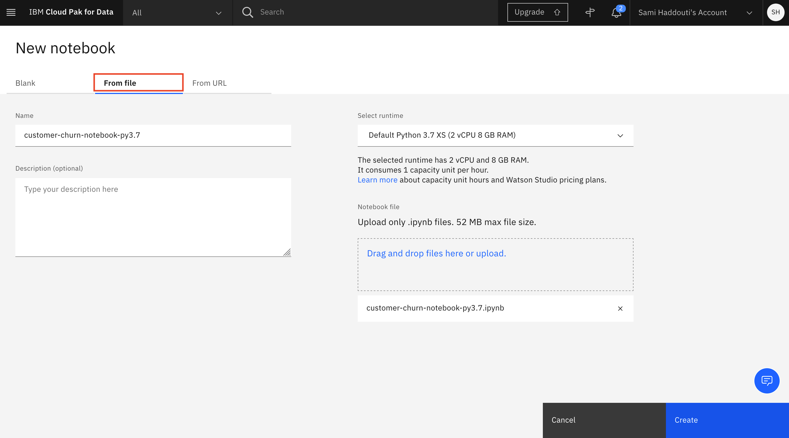
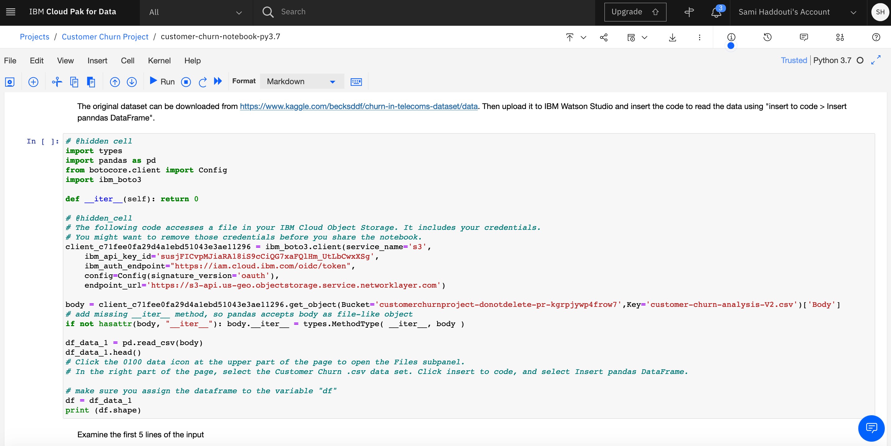

<h1 align="center" style="border-bottom: none;">:bar_chart: IBM Digital Tech Tutorial: Watson Studio Part IV</h1>
<h3 align="center">In this hands-on tutorial you will set up and run Jupyter Notebooks from within IBM Watson Studio to develop a machine learning model.</h3>

## Prerequisites

1. Sign up for an [IBM Cloud account](https://cloud.ibm.com/registration).
2. Fill in the required information and press the „Create Account“ button.
3. After you submit your registration, you will receive an e-mail from the IBM Cloud team with details about your account. In this e-mail, you will need to click the link provided to confirm your registration.
4. Now you should be able to login to your new IBM Cloud account ;-)

## Digital Tech Tutorial Watson Studio Part I to IV

This tutorial consists of 4 parts, you can start with part I or any other part, however, the necessary environment is set up in part I. 
[Part I - data visualization, preparation, and transformation](https://github.com/FelixAugenstein/digital-tech-tutorial-watson-studio) 
[Part II - build and evaluate machine learning models by using the AutoAI](https://github.com/FelixAugenstein/digital-tech-tutorial-watson-studio-part-ii/) 
[Part III - graphically build and evaluate machine learning models by using the SPSS Modeler flow](https://github.com/FelixAugenstein/digital-tech-tutorial-watson-studio-part-iii/) 
[Part IV - set up and run Jupyter Notebooks to develop a machine learning model](https://github.com/FelixAugenstein/digital-tech-tutorial-watson-studio-part-iv/)

The 4 parts of this tutorial are based on the [Learning path: Getting started with Watson Studio](https://developer.ibm.com/series/learning-path-watson-studio/).

## Create the first Jupyter Notebook

Create a Jupyter Notebook for predicting customer churn and change it to use the data set that you have uploaded to the project.

1. In the Asset tab, click Add to Project.

2. Select the Notebook asset type.
3. On the New Notebook page, configure the notebook as follows:

- Select From file tab and upload the customer-churn-kaggle.ipynb file from this repository.
- Enter the name for the notebook (for example, ‘customer-churn-kaggle’).
- Select the Python 3.6 runtime system.
- Click Create Notebook. This initiates the loading and running of the notebook within IBM Watson Studio.

## Run the notebook

The notebook page should now be displayed. If the notebook is not currently open, you can start it by clicking the Edit icon displayed next to the notebook in the Asset page for the project. The notebook should look like this:

From the notebook page, make the following changes:

1. Scroll down to the third cell, and select the empty line in the middle of the cell. If not already open, click the 1001 data icon at the upper part of the page to open the Files subpanel.

2. In the right part of the page, select the Customer Churn .csv data set. Click insert to code, and select Insert pandas DataFrame. This adds code to the data cell for reading the data set into a pandas DataFrame.

Afterwards your Jupyter Notebook should look like this:

3. Make sure you assign the dataframe to the variable "df". Therefore change the variable `df_data_X` to, for instance, `df_data_1` depending on your generated variable. When you execute cell 4 in the notebook, the data frame appears as the following:

4. Select File > Save to save the notebook.

<h3>Background on running Jupyter Notebooks</h3>

When a notebook is run, each code cell in the notebook is executed, in order, from top to bottom.

Each code cell is selectable and is preceded by a tag in the left margin. The tag format is In [x]:. Depending on the state of the notebook, the x can be:

- A blank, which indicates that the cell has never been run
- A number, which represents the relative order that this code step was run
- An *, which indicates that the cell is running

There are several ways to run the code cells in your notebook:

- One cell at a time. Select the cell, and then press Play in the toolbar.
- Batch mode, in sequential order. From the Cell menu, there are several options available. For example, you can Run All cells in your notebook, or you can Run All Below, which starts running from the first cell under the currently selected cell, and then continues running all of the cells that follow.
- At a scheduled time. Press the Schedule button that is located in the upper-right section of your notebook page. Here, you can schedule your notebook to be run once at some future time or repeatedly at your specified interval.

## Data understanding and visualization

## Data preparation

## Modeling and evaluation

## Deploying your model to Watson Machine Learning

## If you have any questions just contact me

Felix Augenstein 
Digital Tech Ecosystem & Developer Representative @IBM 
Twitter: [@F_Augenstein](https://twitter.com/F_Augenstein) 
LinkedIn: [linkedin.com/in/felixaugenstein](https://www.linkedin.com/in/felixaugenstein/)
