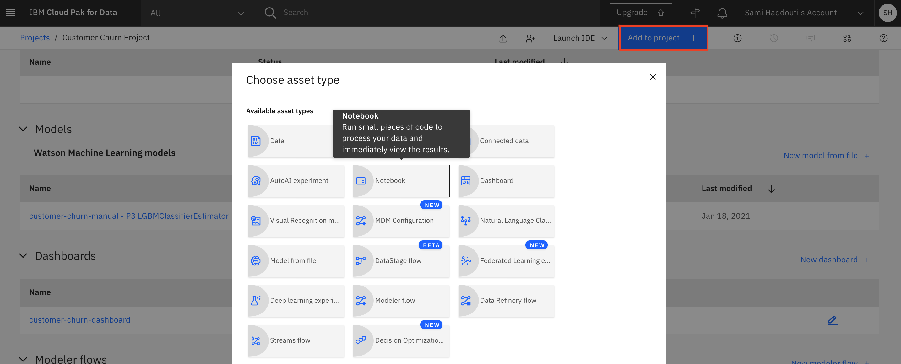

<h1 align="center" style="border-bottom: none;">:bar_chart: IBM Digital Tech Tutorial: Watson Studio Part IV</h1>
<h3 align="center">In this hands-on tutorial you will set up and run Jupyter Notebooks from within IBM Watson Studio to develop a machine learning model.</h3>

## Prerequisites

1. Sign up for an [IBM Cloud account](https://cloud.ibm.com/registration).
2. Fill in the required information and press the „Create Account“ button.
3. After you submit your registration, you will receive an e-mail from the IBM Cloud team with details about your account. In this e-mail, you will need to click the link provided to confirm your registration.
4. Now you should be able to login to your new IBM Cloud account ;-)

## Digital Tech Tutorial Watson Studio Part I to IV

This tutorial consists of 4 parts, you can start with part I or any other part, however, the necessary environment is set up in part I. 
[Part I - data visualization, preparation, and transformation](https://github.com/FelixAugenstein/digital-tech-tutorial-watson-studio) 
[Part II - build and evaluate machine learning models by using the AutoAI](https://github.com/FelixAugenstein/digital-tech-tutorial-watson-studio-part-ii/) 
[Part III - graphically build and evaluate machine learning models by using the SPSS Modeler flow](https://github.com/FelixAugenstein/digital-tech-tutorial-watson-studio-part-iii/) 
[Part IV - set up and run Jupyter Notebooks to develop a machine learning model](https://github.com/FelixAugenstein/digital-tech-tutorial-watson-studio-part-iv/)

The 4 parts of this tutorial are based on the [Learning path: Getting started with Watson Studio](https://developer.ibm.com/series/learning-path-watson-studio/).

## Create the first Jupyter Notebook

Create a Jupyter Notebook for predicting customer churn and change it to use the data set that you have uploaded to the project.

1. In the Asset tab, click Add to Project.

2. Select the Notebook asset type.
3. On the New Notebook page, configure the notebook as follows:

## Run the notebook

## Data understanding and visualization

## Data preparation

## Modeling and evaluation

## Deploying your model to Watson Machine Learning

## If you have any questions just contact me

Felix Augenstein 
Digital Tech Ecosystem & Developer Representative @IBM 
Twitter: [@F_Augenstein](https://twitter.com/F_Augenstein) 
LinkedIn: [linkedin.com/in/felixaugenstein](https://www.linkedin.com/in/felixaugenstein/)
